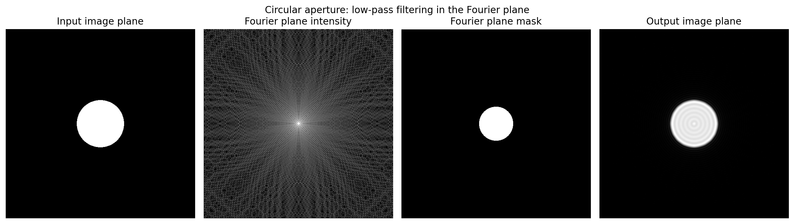
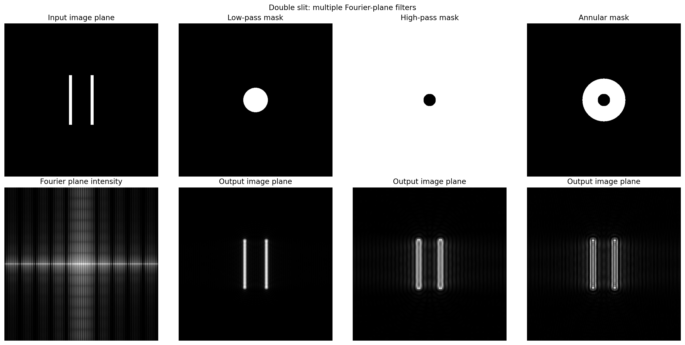
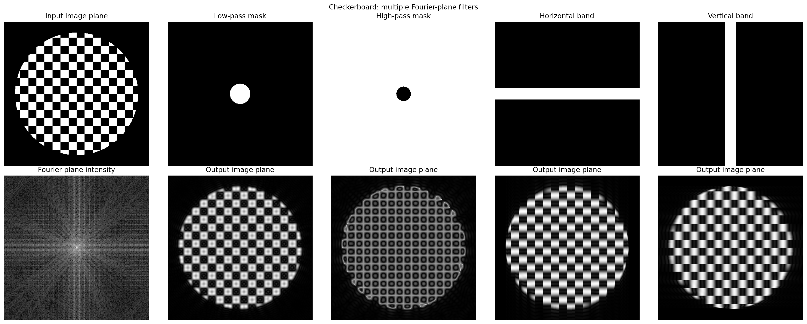
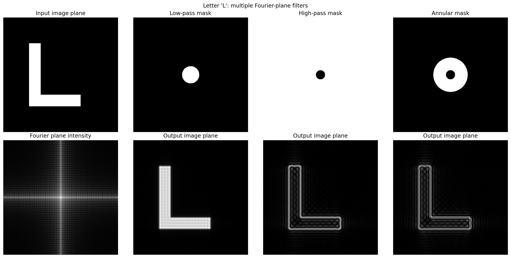
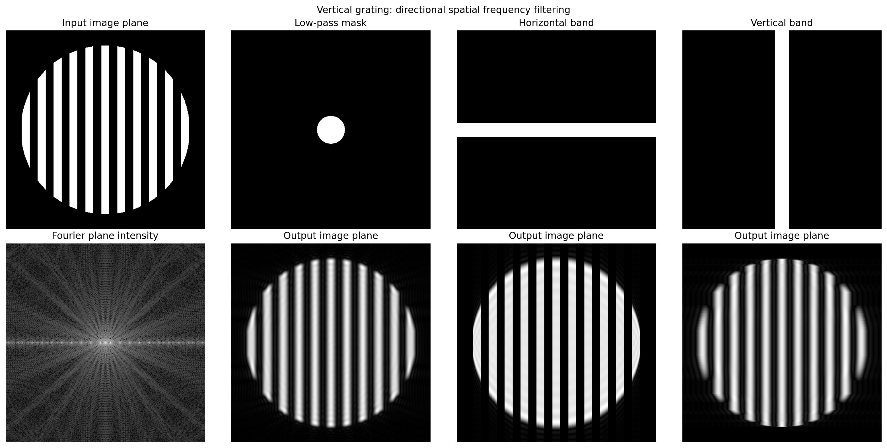

# Fourier Optics and 4F Relay Simulation

## Goal

This project demonstrates the relationship between an input image plane, Fourier plane, and output image plane in an idealized 4F optical system.

In a physical 4F relay, the first lens maps the input field into a Fourier plane, where transverse position corresponds to spatial-frequency content or propagation angle, A mask placed in that Fourier plane modifies the spatial-frequency content. The second lens maps the filtered field back to an output image plane. 

## Concepts Demonstrated

- Image plane
- Fourier plane
- Spatial frequency
- 4F relay
- Low-pass filtering
- High-pass filtering
- Annular filtering
- Directional spatial-frequency filtering
- Relationship between Fourier-plane masks and image structure

## Physical Interpretation

An image plane is a plane where object points map to image points. 

A fourier plane is a plane where position corresponds to spatial frequency or propagation angle. In an ideal 4F system, this plane is located one focal length after the first lens and one focal length before the second lens.

A Fourier-plane mask modifies the reconstructed output image by selectively passing or blocking spatial-frequency content:

- A low-pass mask passes low spatial frequencies and removes fine detail
- A high-pass mask removes low spatial frequencies and emphasizes edges or fine structure. 
- An annular mask passes an intermediate band of spatial frequencies.
- Directional masks demonstrate how different spatial-frequency directions contribute to image structure.

## Simulations

This script generates several input objects and applies different Fourier-plane masks:

1. Circular aperture with low-pass filtering
2. Double slit with low-pass, high-pass, and annular filtering 
3. Checkerboard with low-pass, high-pass, and directional filtering
4. Letter L with multiple Fourier-plane filters
5. Vertical and horizontal gratings with directional spatial-frequency filtering

## Example Results

### Circular aperture

### Double slit

### Checkerboard

### Letter L

### Vertical grating

### Horizontal grating

## Limitations

This is a conceptual scalar Fourier-optics simulation. It does not include real physical units, finite lens apertures, propagation distance scaling, aberrations, polarization, diffraction efficiency, or real lens prescriptions.

## Future Work

Possible extensions include:

- Add physical units, wavelength, pixel spacing and focal length scaling. 
- Add finite pupil apertures and point spread functions.
- Add phase aberrations such as defocus, astigmatism, and coma. 
- Simulate an SLM applying an idealized corrective phase pattern.
- Build a related Zemax 4F relay model using COTS achromatic doublets